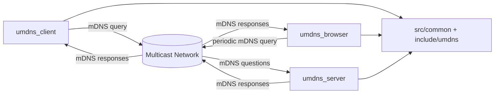
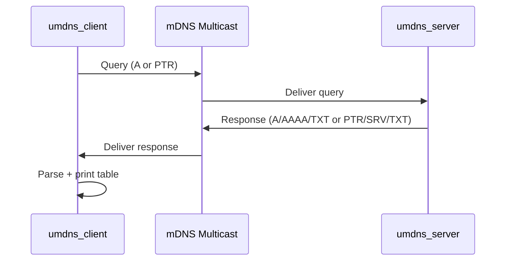

# umdns

Small C99 mDNS toolkit with three utilities:
- `umdns_server`: responds to hostname/service mDNS queries
- `umdns_client`: performs one-shot hostname or service lookups
- `umdns_browser`: repeatedly discovers services on the local network

## Table of Contents
- [Overview](#overview)
- [Features](#features)
	- [General Features](#general-features)
	- [Server Features](#server-features)
	- [Client Features](#client-features)
	- [Browser Features](#browser-features)
- [Build and Run](#build-and-run)
	- [Build](#build)
	- [Smoke Tests](#smoke-tests)
	- [Run Server](#run-server)
	- [Run Client](#run-client)
	- [Run Browser](#run-browser)
- [CLI Reference](#cli-reference)
	- [umdns_server](#umdns_server)
	- [umdns_client](#umdns_client)
	- [umdns_browser](#umdns_browser)
- [Architecture](#architecture)
	- [High-Level Diagram](#high-level-diagram)
	- [Request/Response Flow](#requestresponse-flow)
- [Modules](#modules)
	- [Shared Core Modules](#shared-core-modules)
	- [Tool-Specific Modules](#tool-specific-modules)
- [Configuration](#configuration)
- [Installation](#installation)
	- [Local Install](#local-install)
	- [Remote Install](#remote-install)
- [Troubleshooting](#troubleshooting)

## Overview
`umdns` is a focused mDNS implementation in C99 for Linux. It supports IPv4 and IPv6 sockets, common logging and timeout behavior, and signal-based graceful shutdown for long-running modes.

[Back to top](#table-of-contents)

## Features

### General Features
- C99 build with strict flags and warning-free compilation
- IPv4 + IPv6 listener/query sockets
- Timeout-driven receive loops
- Shared reusable code under `src/common` and `include/umdns`
- Logging to console (default) or file with levels: `debug|info|warn|error`
- Command help output includes usage and examples

[Back to top](#table-of-contents)

### Server Features
- Binds to interface (best effort) and listens for mDNS queries
- Hostname discovery responses (`A`/`AAAA`/`TXT`)
- Service discovery responses (`PTR`/`SRV`/`TXT`)
- INI-style service registration config
- Graceful shutdown via `SIGINT` / `SIGTERM`

[Back to top](#table-of-contents)

### Client Features
- Binds to interface (best effort)
- Accepts timeout parameter (`-t`)
- Defaults to hostname query mode using local hostname
- Supports service discovery (`PTR`, plus `SRV`/`TXT` when provided)
- Reports responses in a structured table
- Enforces exactly one query mode (`-H` or `-s`)

[Back to top](#table-of-contents)

### Browser Features
- Sends periodic network-wide mDNS discovery query for services
- Accepts total timeout (`-t`) and query interval (`-n`)
- Timeout `0` runs continuously until interrupted
- Graceful shutdown via `SIGINT` / `SIGTERM`

[Back to top](#table-of-contents)

## Build and Run

### Build
Prerequisites (Linux):
- POSIX toolchain (`cc`, `make`)

Build all binaries:
```bash
make clean
make all
```

Binaries are generated in `bin/`:
- `bin/umdns_server`
- `bin/umdns_client`
- `bin/umdns_browser`

[Back to top](#table-of-contents)

### Smoke Tests
Run smoke tests (help output + basic local flows):
```bash
make smoke
```

[Back to top](#table-of-contents)

### Run Server
```bash
./bin/umdns_server -i eth0 -c ./config/umdns_server.ini --log-level info
```

[Back to top](#table-of-contents)

### Run Client
Hostname query:
```bash
./bin/umdns_client -H umdns-node -i eth0 -t 3
```

Service query:
```bash
./bin/umdns_client -s _http._tcp -i eth0 -t 5
```

[Back to top](#table-of-contents)

### Run Browser
Finite discovery run:
```bash
./bin/umdns_browser -i eth0 -t 15 -n 3
```

Continuous mode (until Ctrl+C):
```bash
./bin/umdns_browser -i eth0 -t 0 -n 5
```

[Back to top](#table-of-contents)

## CLI Reference

### umdns_server
```text
umdns_server [options]
	-i <iface>          Bind sockets to interface
	-c <config.ini>     INI file with hostname and services
	--log-level <lvl>   debug|info|warn|error
	--log-file <path>   Write logs to file
	-h, --help
```

[Back to top](#table-of-contents)

### umdns_client
```text
umdns_client [options]
	-H <hostname>       Hostname resolution mode
	-s <service_type>   Service resolution mode
	-i <iface>          Bind sockets to interface
	-t <seconds>        Timeout waiting for replies
	--log-level <lvl>   debug|info|warn|error
	--log-file <path>   Write logs to file
	-h, --help
```

[Back to top](#table-of-contents)

### umdns_browser
```text
umdns_browser [options]
	-i <iface>          Bind sockets to interface
	-t <seconds>        Total timeout (0 = infinite)
	-n <seconds>        Query interval
	--log-level <lvl>   debug|info|warn|error
	--log-file <path>   Write logs to file
	-h, --help
```

[Back to top](#table-of-contents)

## Architecture

### High-Level Diagram


[Back to top](#table-of-contents)

### Request/Response Flow


[Back to top](#table-of-contents)

## Modules

### Shared Core Modules
- `src/common/log.c`: log init, levels, console/file sinks
- `src/common/signal.c`: `SIGINT`/`SIGTERM` termination flag handling
- `src/common/socket.c`: IPv4/IPv6 listener setup, multicast join, send/receive helpers
- `src/common/mdns.c`: DNS packet encode/decode for query/response and answer parsing
- `src/common/config.c`: INI parser for server hostname/services
- `src/common/table.c`: structured result table printer

[Back to top](#table-of-contents)

### Tool-Specific Modules
- `src/server/main.c`: query handling loop and response dispatch
- `src/client/main.c`: one-shot query mode and timeout-based collection
- `src/browser/main.c`: periodic discovery loop and result accumulation

[Back to top](#table-of-contents)

## Configuration
Server INI example (`config/umdns_server.ini`):
```ini
[server]
hostname = umdns-node
ipv4 = 127.0.0.1
ipv6 = ::1
txt = role=demo

[service web]
type = _http._tcp
host = umdns-node
port = 8080
txt = path=/
```

Service sections use `service <instance_name>` format.

[Back to top](#table-of-contents)

## Installation

### Local Install
Installs binaries into `~/.local/bin` by default:
```bash
make install
```

Override destination:
```bash
make install PREFIX=/opt/umdns
```

[Back to top](#table-of-contents)

### Remote Install
Copies binaries to a remote host over `scp`:
```bash
make install_remote REMOTE_HOST=user@host REMOTE_PATH=~/.local/bin
```

[Back to top](#table-of-contents)

## Troubleshooting
- If interface bind fails, retry without `-i` to use default route behavior.
- If no responses are received, verify multicast is enabled on the interface.
- Use `--log-level debug` for packet flow diagnostics.
- On restricted systems, multicast membership may require additional network policy configuration.

[Back to top](#table-of-contents)
